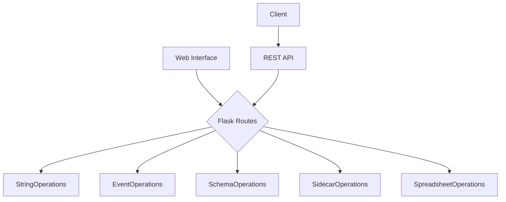

# API Reference Overview

The HED Web Tools API provides a comprehensive set of modules for processing Hierarchical Event Descriptor (HED) data through web interfaces and programmatic access. The API is designed around a service-oriented architecture with clear separation of concerns.

## Architecture Overview



---
## Module Structure

### 1. Application Layer
- **[App Factory](app_factory.md)** - Flask application configuration and initialization
- **[Routes](routes.md)** - Web interface endpoints and HTTP request handling

### 2. Service Layer  
- **[Process Service](process_service.md)** - Core orchestration and business logic
- **[Process Form](process_form.md)** - Form data extraction and validation
- **[Base Operations](base_operations.md)** - Common base classes and shared functionality

### 3. Operation Modules
- **[Event Operations](event_operations.md)** - Process event files with HED annotations
- **[Schema Operations](schema_operations.md)** - Validate and manipulate HED schemas
- **[Sidecar Operations](sidecar_operations.md)** - Handle BIDS sidecar JSON files
- **[Spreadsheet Operations](spreadsheet_operations.md)** - Process tabular data with HED columns
- **[String Operations](string_operations.md)** - Validate and manipulate HED strings

### 4. Utility Modules
- **[Columns](columns.md)** - Column mapping and data structure utilities
- **[Web Utils](web_util.md)** - Common web application helper functions

---

## Service Categories

### HED Schema Services
Handle HED schema files and validation:
- Schema validation and compliance checking
- Format conversion (XML ↔ MediaWiki)
- Schema comparison and analysis
- Version management

### HED String Services  
Process individual HED annotation strings:
- String validation against schemas
- String assembly and combination
- Format conversion and normalization
- Search and pattern matching

### Event Processing Services
Work with event files containing HED annotations:
- Event file validation
- HED assembly (combining sidecars with events)
- Event search and filtering
- Remodeling operations

### Sidecar Services
Handle BIDS sidecar JSON files:
- Sidecar validation
- HED extraction and processing
- Merging multiple sidecars
- BIDS compliance checking

### Spreadsheet Services
Process tabular data with HED information:
- Column mapping to HED concepts
- Batch validation of HED data
- Format conversion (Excel, CSV, TSV)
- Data transformation and export

## API Endpoints

All services are accessible via REST API endpoints under `/services/`:

| Endpoint | Purpose | Operations |
|----------|---------|------------|
| `/services/strings` | HED string operations | validate, assemble, convert |
| `/services/events` | Event file processing | validate, assemble, search, remodel |
| `/services/schemas` | Schema operations | validate, convert, compare |
| `/services/sidecars` | Sidecar file operations | validate, extract, merge |
| `/services/spreadsheets` | Spreadsheet processing | validate, convert, transform |

## Request/Response Format

### Standard Request Format
```json
{
    "service": "service_name",
    "schema_version": "8.3.0",
    "check_for_warnings": true
    // Service-specific parameters...
}
```

### Standard Response Format
```json
{
    "error_type": "success",
    "error_msg": "",
    "results": {
        "data": "...",
        "output_display_name": "result.txt",
        "schema_version": "8.3.0"
        // Service-specific results...
    }
}
```

## Error Handling

The API uses consistent error reporting across all services:

- **success** - Operation completed successfully
- **warning** - Operation completed with non-critical issues
- **error** - Operation failed due to validation or processing errors

Error messages include detailed information about what went wrong and how to fix it.

## File Upload Support

Most services support file uploads for batch processing:

### Supported Formats
- **Event files**: TSV, CSV, Excel (.xlsx, .xls)
- **Schema files**: XML, MediaWiki (.mediawiki)
- **Sidecar files**: JSON
- **Spreadsheets**: Excel, CSV, TSV

### File Processing
- Automatic format detection
- Validation before processing
- Detailed error reporting with line numbers
- Result download in original or converted formats

## Common Parameters

Many services share common parameters:

- **schema_version** - HED schema version to use for validation
- **check_for_warnings** - Include non-critical validation warnings
- **expand_defs** - Expand definition tags in output
- **include_description_tags** - Include description metadata

## Getting Started

1. **Choose your service** based on the type of HED data you're processing
2. **Check the specific module documentation** for detailed parameter information
3. **Use the web interface** for interactive processing
4. **Access REST endpoints** for programmatic integration

## Integration Examples

### Python Integration
```python
import requests

response = requests.post('http://localhost:5000/services/strings', json={
    "service": "strings_validate",
    "schema_version": "8.3.0", 
    "hed_strings": ["Sensory-event, Visual-presentation"]
})
```
### MATLAB Integration

See the web services examples in the [hed-matlab](https://github.com/hed-standard/hed-matlab)
GitHub repository for detailed examples of calling these services from MATLAB.

### Web Interface
Navigate to the appropriate section (Strings, Events, etc.) and use the form-based interface 
for interactive processing.

For detailed information about each module's functions, classes, and parameters, 
see the individual module documentation pages.
