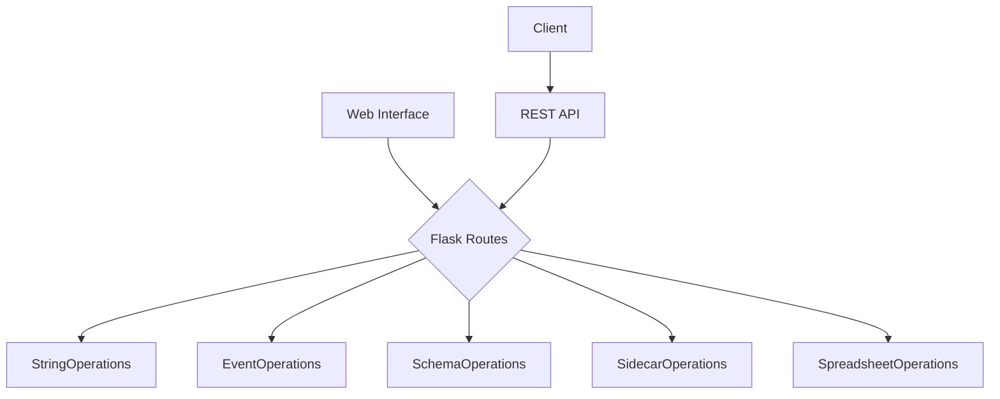

# HED Web Tools

<div align="center">
  <h2>🧠 Hierarchical Event Descriptor Web Interface</h2>
  <p><em>Powerful web-based tools for processing and validating HED annotations</em></p>
</div>

---

## What is HED Web?

HED Web Tools provides an intuitive **web-based interface** for working with Hierarchical Event Descriptor (HED) data. Whether you're a researcher annotating experimental data or a developer integrating HED processing into your workflow, our tools make HED operations accessible and efficient.

### 🎯 Key Features

<div class="grid" markdown>

!!! tip "**Easy Web Interface**"
    User-friendly forms for all HED operations - no programming required!

!!! info "**REST API Access**"
    Full programmatic access with JSON-based REST endpoints

!!! success "**Multiple File Formats**"
    Support for TSV, CSV, Excel, JSON, and more

!!! warning "**Real-time Validation**"
    Immediate feedback with detailed error reporting

</div>

---

## 🚀 Quick Start

### For Web Users
1. **Start the server**: `python -m hedweb.runserver`
2. **Open your browser**: Navigate to `http://localhost:5000`
3. **Choose your task**: Select from HED Strings, Events, Schemas, Sidecars, or Spreadsheets
4. **Upload and process**: Get instant validation and results

### For Developers
```python
import requests

# Validate a HED string
response = requests.post('http://localhost:5000/services/strings', json={
    "service": "strings_validate",
    "schema_version": "8.3.0",
    "hed_strings": ["Sensory-event, Visual-presentation, (Image, Face)"]
})

result = response.json()
print(f"Validation: {result['error_type']}")
```

---

## 🛠️ What Can You Do?

### HED String Operations
- **Validate** individual HED annotation strings
- **Assemble** complex HED strings from components
- **Convert** between different HED formats
- **Search** for specific patterns in annotations

### Event File Processing
- **Validate** event files with HED annotations
- **Assemble** complete annotations from sidecars and events
- **Search** for events matching HED criteria
- **Remodel** event structures and transformations

### Schema Management
- **Validate** HED schema files for compliance
- **Convert** between XML and MediaWiki formats
- **Compare** different schema versions
- **Extract** schema information and statistics

### BIDS Sidecar Support
- **Validate** BIDS sidecar JSON files
- **Extract** HED-related information
- **Merge** multiple sidecar files
- **Ensure** BIDS compliance

### Spreadsheet Processing
- **Map** spreadsheet columns to HED concepts
- **Validate** HED data in tabular formats
- **Convert** between Excel, CSV, and TSV
- **Process** large datasets efficiently

---

## 🏗️ Architecture

HED Web Tools is built with a **Flask-based web architecture**:



---

## 📖 Documentation Sections

<div class="grid cards" markdown>

-   :material-rocket-launch:{ .lg .middle } **[Introduction](introduction.md)**
    
    ---
    
    Learn about HED and how the web tools work

-   :material-book-open:{ .lg .middle } **[User Guide](user_guide.md)**
    
    ---
    
    Step-by-step tutorials and examples

-   :material-code-braces:{ .lg .middle } **[API Reference](api/index.md)**
    
    ---
    
    Complete technical documentation for developers

</div>

---

## 🎓 Getting Started Guide

### New to HED?
1. Read the **[Introduction](introduction.md)** to understand HED concepts
2. Try the **web interface** with sample data
3. Follow the **[User Guide](user_guide.md)** for common tasks

### Ready to Integrate?
1. Check the **[API Reference](api/index.md)** for technical details
2. Use the **REST endpoints** for programmatic access
3. Review **code examples** in the documentation

### Want to Contribute?
1. Visit our **[GitHub repository](https://github.com/hed-standard/hed-web)**
2. Check the **issue tracker** for ways to help
3. Read the **contribution guidelines**

---

## 💡 Example Use Cases

!!! example "Research Workflow"
    A neuroscience researcher uploads an event file from their EEG experiment, validates the HED annotations, and downloads a cleaned dataset ready for analysis.

!!! example "BIDS Dataset Preparation"
    A data curator validates multiple sidecar files for a BIDS dataset, ensuring all HED annotations meet the standard requirements.

!!! example "Automated Pipeline"
    A developer integrates HED validation into their data processing pipeline using the REST API to automatically check annotations.

!!! example "Schema Development"
    A HED schema developer validates and converts schema files between formats while developing new HED vocabulary.

---

## 🔗 Related Projects

- **[HED Python Tools](https://github.com/hed-standard/hed-python)** - Core HED processing library
- **[HED Specification](https://github.com/hed-standard/hed-specification)** - Official HED standard
- **[HED Examples](https://github.com/hed-standard/hed-examples)** - Sample datasets and tutorials

---

<div align="center">
  <p><strong>Ready to get started?</strong></p>
  <p>
    <a href="introduction/" class="md-button md-button--primary">Learn More</a>
    <a href="user_guide/" class="md-button">User Guide</a>
    <a href="api/" class="md-button">API Docs</a>
  </p>
</div>
